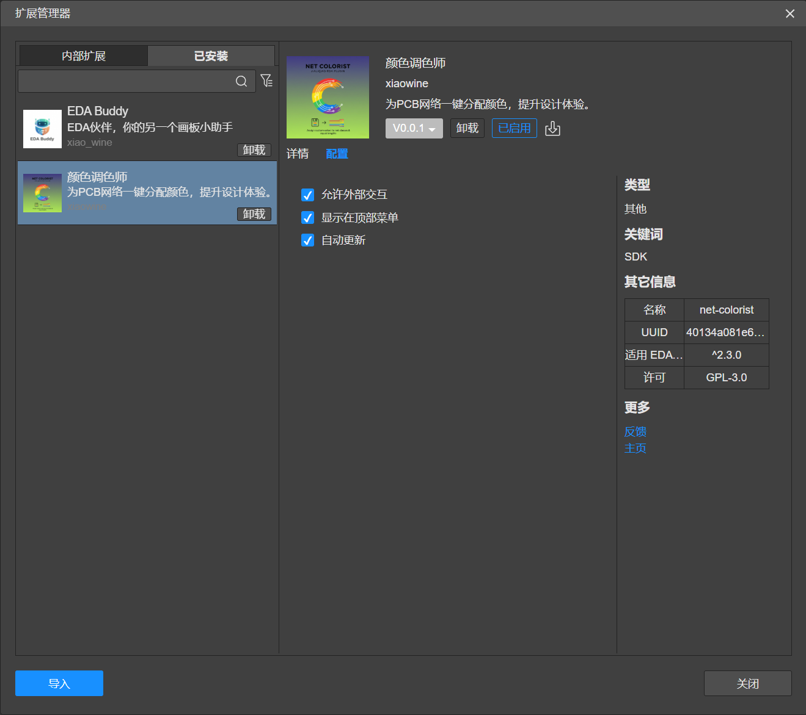
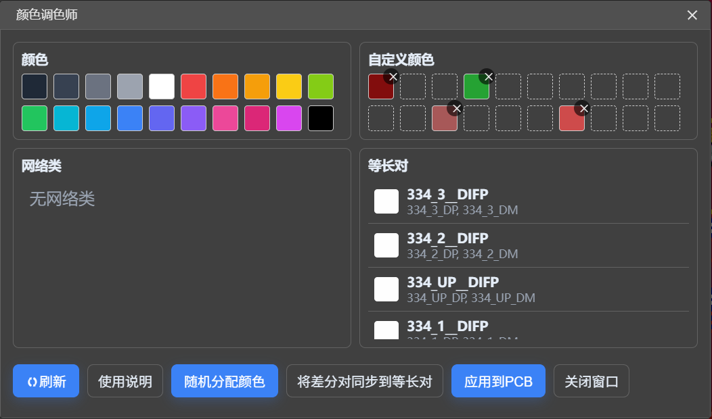
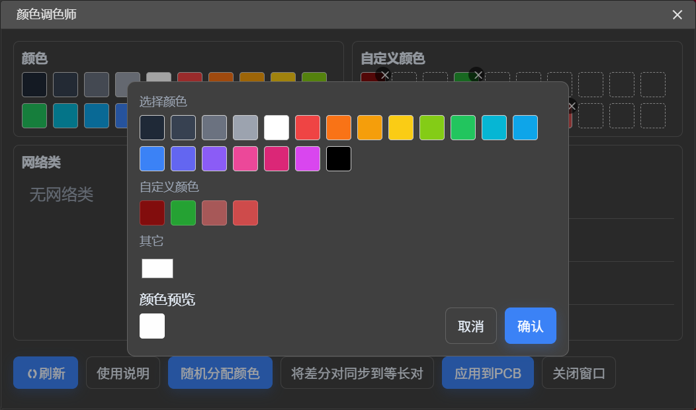
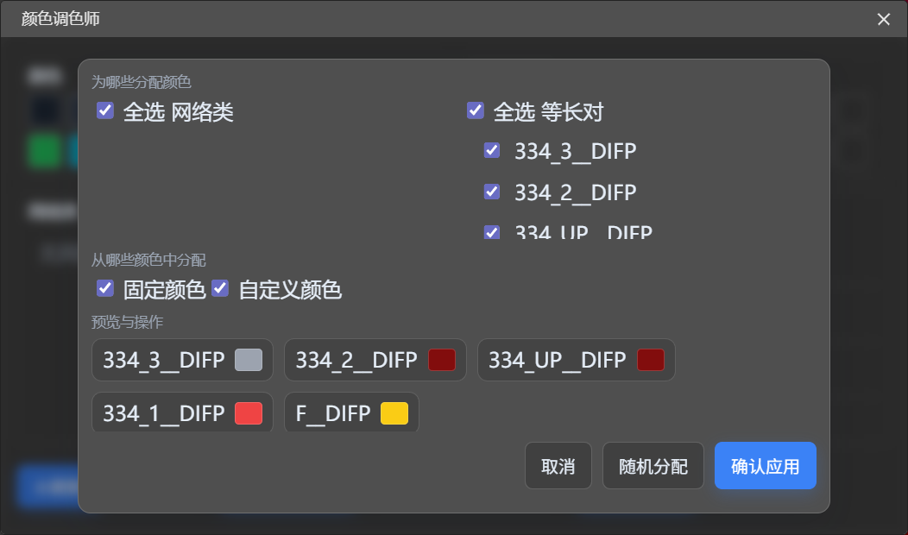

# Net Colorist

**主要功能**

- 为网络类和等长对分配颜色，提升 PCB 可读性
- 支持自定义颜色池与随机分配
- 将差分对同步为等长对以便设置颜色
- 一键将设置的颜色应用到 PCB

**使用说明**

- 对于在嘉立创EDA：
    - 直接点击安装即可
- 对于 Github:
    - 前往[Release](https://github.com/xiaowine/Net-Colorist/releases)下载`net-colorist_vx.x.x.eext`文件  
      之后前往嘉立创顶栏->高级->扩展管理器->右下角导入，选择下载的文件进行安装

#### 使用小提示:在嘉立创 EDA 扩展管理器中勾选`显示在顶部菜单栏`以便快速访问插件功能。

**功能快速预览（深色模式截图）**

**贡献与反馈**

欢迎在[Github仓库](https://github.com/xiaowine/Net-Colorist)提交 Issue/PR
提交前请运行现有 lint/格式化脚本并附上复现步骤。

或者前往[嘉立创扩展广场](https://ext.lceda.cn/item/xiao_wine/net-colorist)反馈建议与问题。

**许可证**

本项目采用 GPL v3 许可证。
